:show-content:

=====
Taxes
=====

Odoo makes it easy to keep up with tax obligations, whether it's correctly quoting tax amounts on
sales, keeping track of tax debit and credit, or completing tax returns.

Overview of the tax flow
========================

In a nutshell, the flow for managing taxes within Odoo goes like this:

1. You add taxes on documents created via the Sale, Purchase and Accounting and Point of Sale apps.
2. Odoo automatically computes tax amounts.
3. On accounting documents, Odoo generates journal items to keep track of tax debit and tax credit.
4. You can view the amounts billed and taxed in the Tax Return report and use them to file a tax
   return.

Add taxes on sales and purchases
--------------------------------

Most sale and purchase documents have a :guilabel:`Taxes` field where taxes can be applied to sale
or purchase lines. This includes :doc:`Invoices <customer_invoices>` and :doc:`Vendor Bills
<vendor_bills>` in the :guilabel:`Accounting` app, :doc:`Sales quotations
<../../sales/sales/sales_quotations>` in the :guilabel:`Sales` app, and :doc:`Purchase Orders
<../../inventory_and_mrp/purchase/manage_deals/rfq>` in the :guilabel:`Purchase` app.

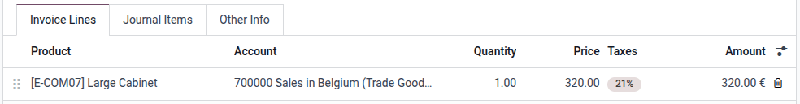

Automatic computation of tax amounts
------------------------------------

Applying a tax on a sale or purchase line lets Odoo automatically compute a tax amount based on
the sale or purchase line's subtotal and the tax's configuration. The details of the computation are
explained in the :doc:`Tax Computation <taxes/tax_computation>` page.

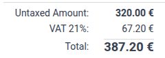

Automatic generation of tax journal items
-----------------------------------------

Upon applying a tax on an :doc:`Invoice <customer_invoices>` or :doc:`Vendor Bill <vendor_bills>`, a
Tax Payable journal item is automatically generated with the tax amount. This keeps track of the tax
debit or credit associated with the transaction.

Furthermore, the tax amount is added to the amount due on the Account Receivable or Payable journal
item.

Finally, :ref:`Tax Grids <tax-returns/tax-grids>` are added both to the automatically created Tax
Payable journal item and to the invoice line on which the tax is applied. These tags are used to
retrieve the journal items corresponding to the tax's base and tax amount in the :doc:`Tax Return
<reporting/tax_returns>` report.

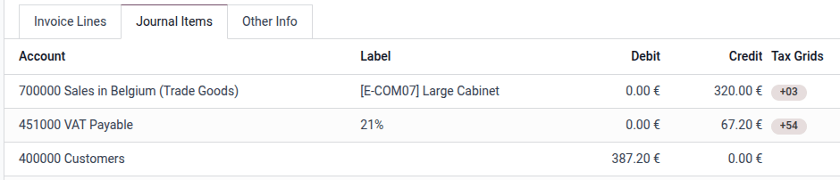

.. note::
   If :doc:`Cash Basis <taxes/cash_basis>` is enabled, upon reconciling the invoice or vendor bill
   with the payment, an additional journal entry is created to represent the creation of the tax
   debit or credit at that point in time.

View amounts taxed for a period
-------------------------------

The base and tax amounts billed for each tax over a given period can be viewed in the
:doc:`Tax Return <reporting/tax_returns>` report.

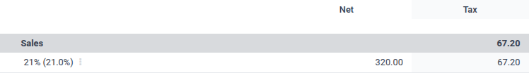

.. _taxes/configuration:

Basic tax configuration
=======================

The following basic steps will set up taxes for production use in Odoo.

1. Enable any relevant :ref:`company-wide options <taxes/configuration/company>`
2. Activate any needed :ref:`pre-configured taxes <taxes/list_activation>`
3. Assign taxes on your :ref:`products <taxes/product>`

.. _taxes/configuration/company:

Company-wide options
--------------------

To access these configuration options, go to :menuselection:`Accounting --> Configuration
--> Settings` and scroll down to :guilabel:`Taxes`.

.. _taxes/default:

Default taxes
~~~~~~~~~~~~~

The default :guilabel:`Sales Tax` and :guilabel:`Purchase Tax` are automatically set on products
when creating new products.

<<<<<<< d890726ca7e0f172ec1aa0833d7c0458c3200e51
.. image:: taxes/default-configuration.png
   :alt: Odoo fills out the Tax field automatically according to the Default Taxes

To change your **default taxes**, go to :menuselection:`Accounting --> Configuration --> Settings`,
scroll down to the :guilabel:`Taxes` section, select the appropriate default sales and purchase
taxes in the :guilabel:`Default Taxes` field, and click on :guilabel:`Save`.
||||||| 4186daf2e61a45afefa1be7f5c7cf6169daf2324
.. image:: taxes/default-configuration.png
   :alt: Odoo fills out the Tax field automatically according to the Default Taxes

To change your **default taxes**, go to :menuselection:`Accounting --> Configuration --> Settings
--> Taxes --> Default Taxes`, select the appropriate taxes for your default sales tax and purchase
tax, and click on :guilabel:`Save`.
=======
If :ref:`Accounting Firms <accounting/fiduciaries>` mode is enabled, the default sales tax is
automatically set on new invoice lines, and the default purchase tax is automatically set on new
vendor bill lines.
>>>>>>> eae2a5b6fca9c7250b5f9448fd776e4b223b3c1e

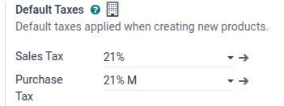

:guilabel:`Prices` can be changed to :guilabel:`Tax Included` to treat all taxes as :ref:`Tax
Included <taxes/included-in-price>` by default. This would be appropriate if all of a company's
pricing is done tax-included.

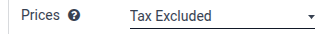

EU intra-community distance selling
~~~~~~~~~~~~~~~~~~~~~~~~~~~~~~~~~~~

Activate this option if you need to sell to consumers in other EU countries and apply local VAT
rates. More information can be found at the :doc:`EU intra-community distance selling
<taxes/eu_distance_selling>` page.

Cash basis
~~~~~~~~~~

Activate this option if taxes must be accounted for on a cash rather than accruals basis. This might
be the case if the company operates under such a legal regime. Some countries mandate cash basis
accounting, in which case this option will be activated by default by the :doc:`fiscal localization
package <../fiscal_localizations>`. More information can be found at the :doc:`Cash Basis
<taxes/cash_basis>` page.

.. _taxes/list_activation:

Activate pre-configured taxes
-----------------------------

The list of taxes can be accessed at :menuselection:`Accounting --> Configuration --> Taxes`.

By default, inactive taxes are created for most sales tax rates, but only the main tax rate is 
active by default. To activate an inactive tax, click the toggle in the :guilabel:`Active` column.

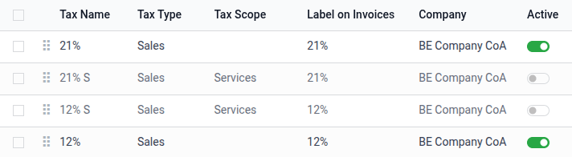

.. _taxes/product:

Assign taxes on products
------------------------

To configure the taxes used for each product, go to :menuselection:`Accounting --> Customers -->
Products`, select the product to configure, and fill the :guilabel:`Sales Taxes` and
:guilabel:`Purchase Taxes` fields. These taxes are automatically applied when adding the product to
a sale or purchase.

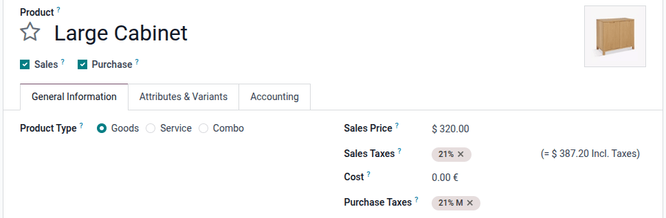

.. tip::
   Use the :ref:`Default Taxes <taxes/default>` company-wide setting to automatically fill these
   fields on new products.

.. _taxes/configuration/advanced:

Advanced tax configuration
==========================

The following aspects of a tax can be customized:

- How it :ref:`appears in the backend <taxes/configuration/back-end>`
- How it :ref:`appears to customers <taxes/configuration/customer>`
- The details of the :doc:`tax computation <taxes/tax_computation>`
- How Tax Payable journal items are created
- :doc:`Fiscal positions <taxes/fiscal_positions>` (how to replace a tax by another tax under certain conditions)

To open a tax's configuration, go to :menuselection:`Accounting --> Configuration --> Taxes`, then
click the tax name.

.. _taxes/configuration/back-end:

Configure back-end appearance and availability
----------------------------------------------

The following options control how a tax appears to users in the Odoo back-end.

.. _taxes/name:

Tax name
~~~~~~~~

The :guilabel:`Tax Name` appears for backend users in the :guilabel:`Taxes` field in :doc:`sales
orders <../../sales/sales>`, :doc:`invoices <customer_invoices>`, product forms, etc.

.. _taxes/scope:

Tax type
~~~~~~~~

The :guilabel:`Tax Type` determines where the tax is available to be selected.

- **Sales**: Customer invoices, product customer taxes, etc.
- **Purchase**: Vendor bills, product vendor taxes, etc.
- **None**

.. tip::
   You can use :guilabel:`None` for taxes that you want to include in a :ref:`Group of Taxes
   <taxes/computation>` but that you do not want to list along with other sales or purchase taxes.

Tax scope
~~~~~~~~~

The :guilabel:`Tax Scope` restricts the use of taxes to a type of product, either **goods** or
**services**.

<<<<<<< d890726ca7e0f172ec1aa0833d7c0458c3200e51
.. _taxes/tax-mapping:

Tax mapping
-----------

Taxes can be combined with :doc:`fiscal positions <taxes/fiscal_positions>` to map taxes to each
other so that the correct tax is applied based on the customer's or vendor's location and business
type.

When configuring a tax, leave the :guilabel:`Fiscal Position` field blank to apply the tax across
all fiscal positions or select specific fiscal positions where this tax should be used. If one or
multiple fiscal positions are selected, use the :guilabel:`Replaces` field to select all of the
taxes that this tax should replace for the selected fiscal position(s).

To replace one tax with multiple other taxes, configure each of the replacement taxes to replace the
default product tax.

.. example::
   As a sales tax, the :guilabel:`0% Exports` tax applies to quotations, sales orders, and invoices
   that use the :guilabel:`Foreign Trade` fiscal position. On those records, any time that the
   :guilabel:`15%` tax would be used, the :guilabel:`0% Exports` tax is used instead.

.. note::
   Since the first fiscal position in the sequence is considered the company's default, the taxes
   set on products are expected to be used with that fiscal position, so the :guilabel:`Replaces`
   field is not displayed on it.

   .. image:: taxes/tax-mapping-example.png
      :alt: The **0% Exports** tax record

.. tip::
   To more easily view which taxes are replaced, use the :icon:`oi-settings-adjust`
   :guilabel:`adjust settings` in the taxes list view and display the :guilabel:`Replaces` field.

   .. image:: taxes/tax-mapping-list.png
      :alt: The **Replaces** field shown in the list view

.. note::
   Tax mapping only works with :ref:`taxes/active` taxes.

.. _taxes/definition-tab:
||||||| 4186daf2e61a45afefa1be7f5c7cf6169daf2324
.. _taxes/definition-tab:
=======
Description
~~~~~~~~~~~
>>>>>>> eae2a5b6fca9c7250b5f9448fd776e4b223b3c1e

The :guilabel:`Description` can be edited for the purpose of internal documentation.

.. _taxes/configuration/customer:

Configure how the tax appears to your customers
-----------------------------------------------

.. _taxes/label-invoices:

Label on invoices
~~~~~~~~~~~~~~~~~

The :guilabel:`Label on Invoices` appears on invoice lines in invoice PDFs and on the customer
portal.

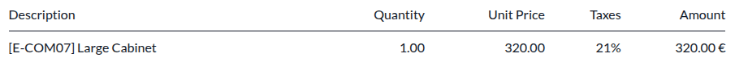

.. _taxes/tax-group:

Tax group
~~~~~~~~~

The :guilabel:`Tax Group` is shown in the totals section of the invoice, in invoice PDFs and on the
customer portal. Multiple taxes that belong to the same tax group are aggregated together into a
single tax amount.

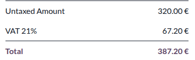

.. _taxes/definition-tab:

Configure how tax journal items are created
-------------------------------------------

The :guilabel:`Distribution for Invoices` and :guilabel:`Distribution for Refunds` sections control
the generation of Tax Payable journal items in invoices and credit notes, respectively. They also
determine which :guilabel:`Tax Grids` are set on invoice lines when this tax is applied.

Each of these sections should contain one :guilabel:`Base` line, one :guilabel:`100.00% of tax`
line, and optionally a :guilabel:`-100.00% of tax` line.

The :guilabel:`Base` line can have one or more :ref:`Tax Grids <tax-returns/tax-grids>` set. Those
:guilabel:`Tax Grids` will be added to the invoice lines on which the tax is applied.

The :guilabel:`100.00% of tax` line controls the creation of the Tax Payable journal item with the
tax amount that represents the tax liability or credit associated with the tax. It should specify
the :guilabel:`Account` in which to create the journal item, and can provide one or more
:guilabel:`Tax Grids` to set on the journal item.

Optionally, a :guilabel:`-100.00% of tax` line can be added. In this case, a second Tax Payable or
Tax Receivable journal item will be created with the negative amount of the tax. Use this if a
non-zero tax amount must be computed, but the application of the tax simultaneously generates both a
tax debit and a tax credit which cancel each other out (e.g. EU intra-community reverse-charge VAT).

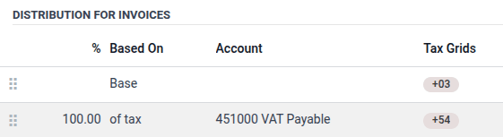

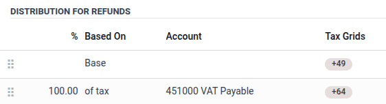

Extra taxes
===========

`TODO ANDU: Remove this section. I'm leaving it while we consider to what extent the content is
useful and whether/where we should include it.`

"Extra taxes" is a broad term referring to additional taxes beyond the standard or basic taxes
imposed by governments. These extra taxes can be **luxury** taxes, **environmental** taxes,
**import** or **export duties** taxes, etc.

.. note::
   The method to compute these taxes varies across different countries. We recommend consulting your
   country's regulations to understand how to calculate them for your business.

To compute an extra tax in Odoo, :ref:`create a tax <taxes/configuration>`, enter a tax name, select
a :ref:`Tax Computation <taxes/configuration>`, set an :guilabel:`Amount`, and in the
:guilabel:`Advanced Options` tab, enable :guilabel:`Affect Base of Subsequent Taxes`. Then, drag and
drop the taxes in the :ref:`order they should be computed <taxes/base-subsequent>`.

.. example::
   - In Belgium, the formula to compute an environmental tax is: `(product price + environmental
     tax) x sales tax`. Therefore, our environmental tax has to come *before* the sales tax in the
     computation sequence.
   - In our case, we created a 5% environmental tax (Ecotax) and put it *before* the Belgian base
     tax of 21%.

   .. image:: taxes/ecotax.png
      :alt: Environmental tax sequence in Belgium.

.. seealso::
  - :doc:`taxes/fiscal_positions`
  - :doc:`taxes/B2B_B2C`
  - :doc:`reporting/tax_returns`

.. toctree::
   :titlesonly:

   taxes/cash_basis
   taxes/tax_computation
   taxes/retention
   taxes/vat_verification
   taxes/fiscal_positions
   taxes/avatax
   taxes/eu_distance_selling
   taxes/B2B_B2C
