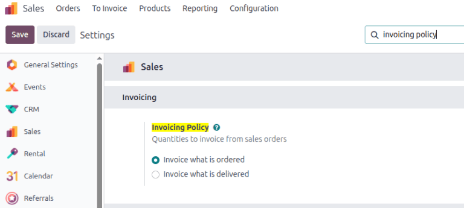
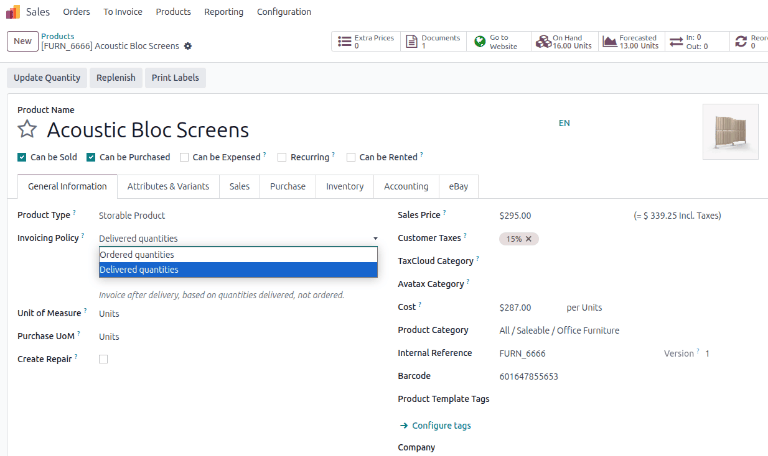
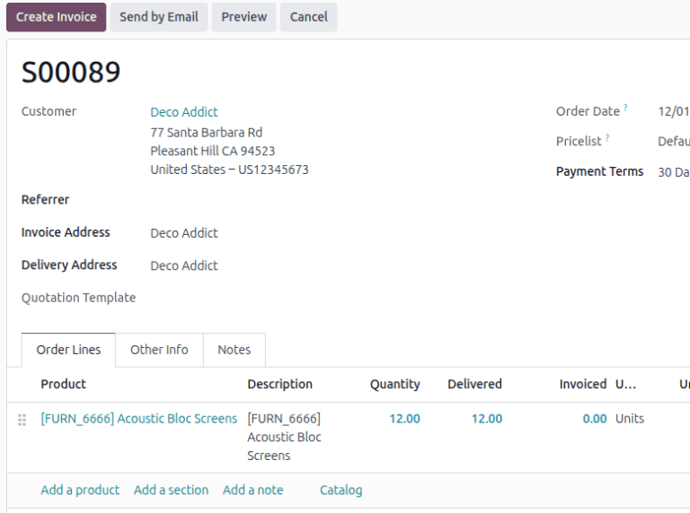

================================================
Invoice based on delivered or ordered quantities
================================================

Being able to have different invoicing options provides more flexibility. Different business
policies might require different options for invoicing. Odoo has too invoicing options to allow
businesses to make the best choice for their needs: *Invoice what is ordered* and *Invoice what is
delivered*.

- The Invoice what is ordered rule is used as the default mode in Odoo **Sales**, which means
  customers are invoiced once the sales order is confirmed.
- The Invoice what is delivered rule invoices customers once the delivery is done. This rule is
  often used for businesses that sell large quantities of physical goods in each sales order. In
  these cases, the ordered quantity may differ slightly from the delivered quantity based on product
  availability.

.. example::
   A produce distributor using the invoice what is delivered rule sells 50 heads of lettuce to a
   restaurant. At the time the delivery is made, only 48 heads are available. The restaurant is
   invoiced for the 48 heads that are delivered, and later receives a second invoice for the
   remaining 2 heads when the distributor is able to complete the order.

Invoicing policy features
=========================

To activate the necessary invoicing policy features, go to :menuselection:`Sales app -->
Configuration --> Settings`, and under the :guilabel:`Invoicing` heading, select an
:guilabel:`Invoicing Policy` rule: :guilabel:`Invoice what is ordered` or :guilabel:`Invoice what is
delivered`.

.. important::
   Activating an invoicing policy rule automatically applies the chosen policy rule to all newly
   created products. Any existing products **must** have their invoicing policy manually updated on
   their product forms. Additionally, if the :guilabel:`Invoice what is delivered` rule is chosen,
   it is **not** possible to activate the :guilabel:`Automatic Invoice` feature, which automatically
   generates invoices when an online payment is confirmed.

Changing the invoicing policy on product forms
==============================================

First, navigate to a product page through :menuselection:`Sales app --> Products --> Products
dashboard`. Locate the :guilabel:`Invoicing Policy` option located under the :guilabel:`General
Information` tab. Use the drop-down menu to change the policy.

Impact on sales flow
====================

In Odoo *Sales*, the basic sales flow starts with the creation of a quotation that is sent to a
customer. Confirming the quotation creates a sales order, and confirming the sales order creates an
invoice.

The following is a breakdown of how invoicing policy rules impact the sales flow:

- :guilabel:`Invoice what is ordered`: No impact on the basic sales flow. An invoice is created as
  soon as a sale is confirmed.
- :guilabel:`Invoice what is delivered`: Minor impact on sales flow, because the delivered quantity
  needs to be manually entered on the sales order. Alternatively, the **Inventory** app can be
  installed and used to confirm the delivered quantity before creating an invoice.

.. warning::
   If a user attempts to create an invoice without validating the delivered quantity, the system
   returns an error message alerting them to the issue.

   .. image:: invoicing_policy/invoicing-policy-error-message.png
      :alt: If Delivered Quantities invoicing policy is chosen, ensure a quantity has been
            delivered.

Once a quotation is confirmed, and the status changes from :guilabel:`Quotation sent` to
:guilabel:`Sales order`, the delivered and invoiced quantities are available to view, directly from
the sales order. This is true for both invoicing policy rule options.

Odoo automatically adds the quantities to the invoice, both :guilabel:`Delivered` and
:guilabel:`Invoiced`, even if it's a partial delivery, when the quotation is confirmed.

.. seealso::
   :doc:`/applications/sales/sales/invoicing/down_payment`
